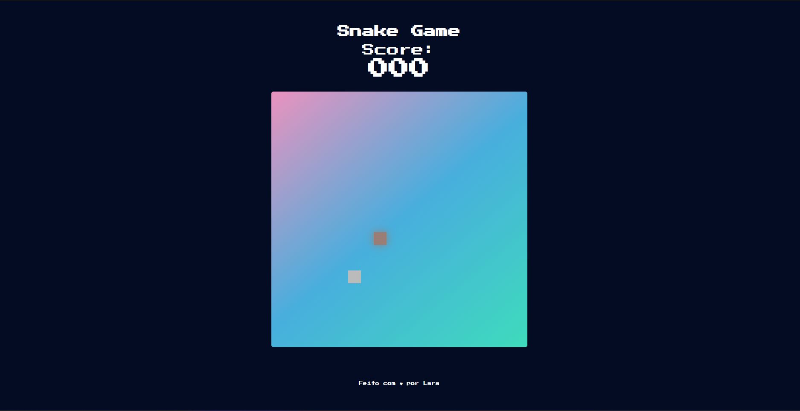
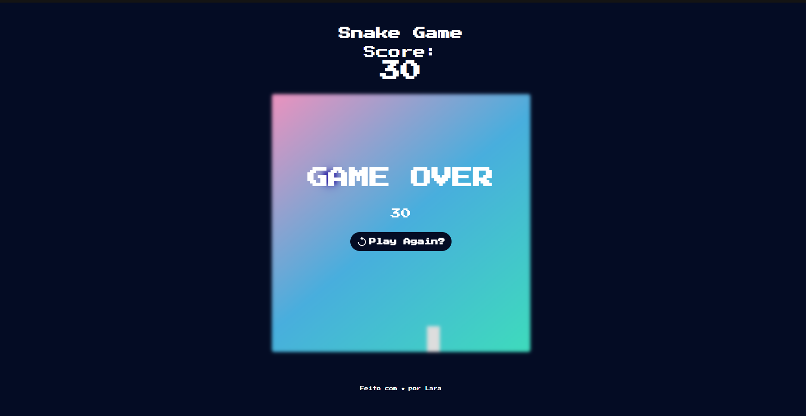
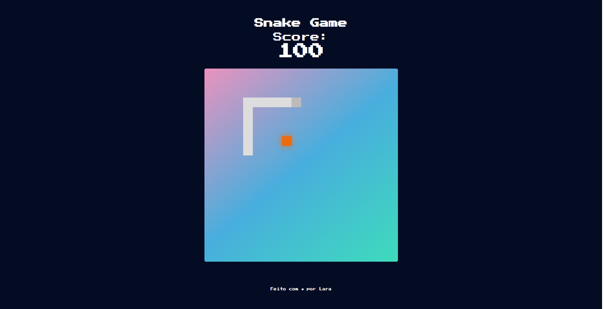

<h1 align="center"> Snake Game</h1>

  Snake is a sub-genre of action video games where the player maneuvers the end of a growing line, often themed as a snake. The player must keep the snake from colliding with both other obstacles and itself, which gets harder as the snake lengthens.  

  <a href="#-tecnologias">Techs/Tecnologias</a>&nbsp;&nbsp;&nbsp;|&nbsp;&nbsp;&nbsp;
  <a href="#-projeto">Project/Projeto</a>&nbsp;&nbsp;&nbsp;|&nbsp;&nbsp;&nbsp;
  <a href="#-layout">Layout</a>&nbsp;&nbsp;&nbsp;|&nbsp;&nbsp;&nbsp;
  <a href="#memo-licença">License/Licença</a>

  

  

  

## 🚀 Techs / Tecnologias

Esse projeto foi desenvolvido com as seguintes tecnologias:

- HTML e CSS
- JavaScript
- Git e Github

## 💻 Project / Projeto

This projects consists on the "head" of the snake continually moves forward, unable to stop, growing ever longer. It must be steered left, right, up, and down to avoid hitting walls and the body of either snake. When it crashed the game is over and shows the final score on screen. 

Este projeto consiste na “cabeça” da cobra avançar continuamente, sem conseguir parar, crescendo cada vez mais. Ele deve ser direcionado para a esquerda, para a direita, para cima e para baixo para evitar bater nas paredes e no corpo de qualquer uma das cobras. Quando travou, o jogo termina e mostra a pontuação final na tela.

## 🔖 Layout

Você pode visualizar o layout do projeto através do deploy. 
